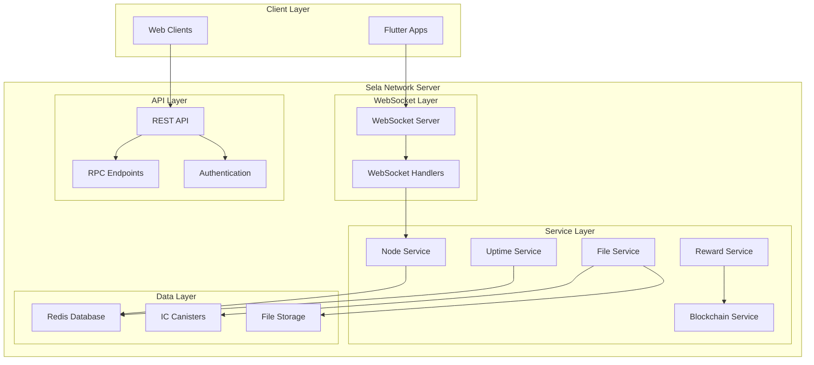
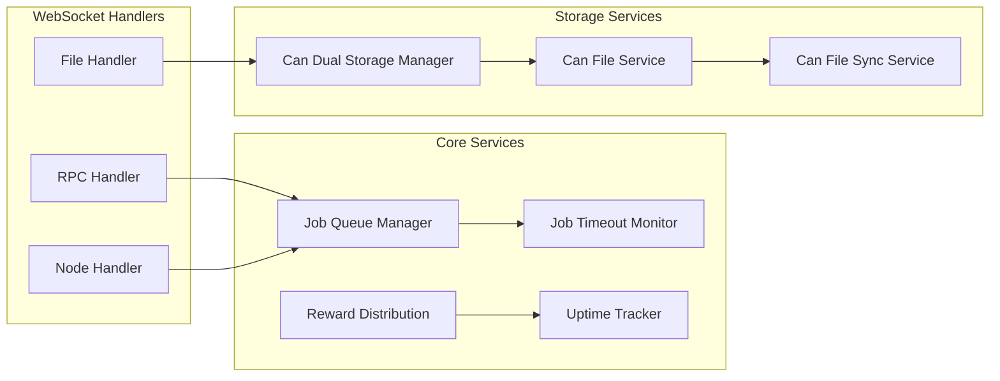
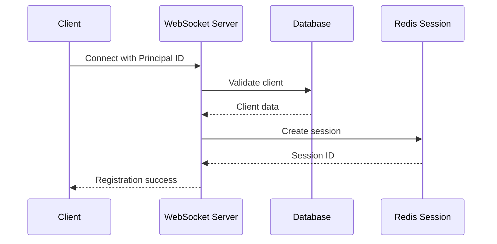
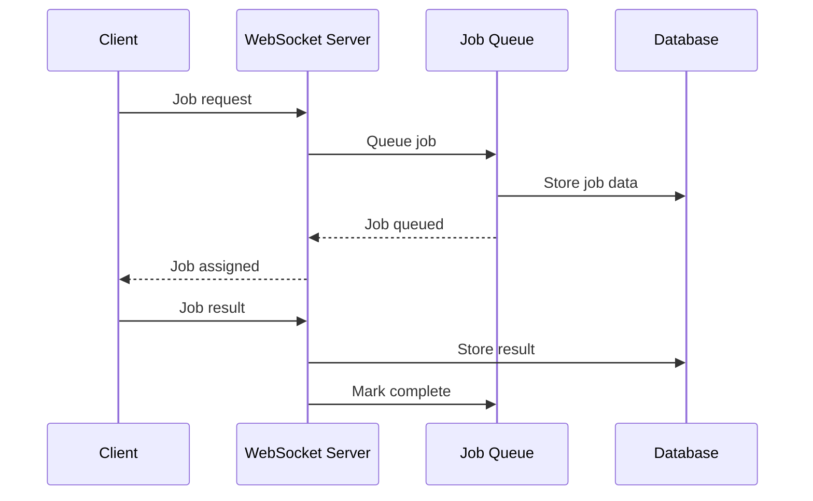

# Sela Network WebSocket Server

[](https://www.typescriptlang.org/)
[](https://nodejs.org/)
[](https://redis.io/)
[](https://www.docker.com/)
[](LICENSE)

A high-performance, enterprise-grade WebSocket server built with TypeScript for real-time communication with Flutter applications. Features comprehensive job management, reward distribution, blockchain integration, and dual storage capabilities.

## 🚀 Features

### Core Capabilities
- **Real-time WebSocket Communication**: Bidirectional communication with Flutter apps
- **Hybrid Architecture**: WebSocket + REST API in a single server
- **Type Safety**: Full TypeScript implementation with comprehensive type definitions
- **Scalable Job Management**: Advanced job queue system with timeout monitoring
- **Reward Distribution**: Automated reward calculation and distribution system
- **Blockchain Integration**: Internet Computer (ICP) blockchain integration
- **Dual Storage**: Redis + Canister storage with automatic synchronization
- **File Management**: Complete file upload/download system with chunked transfers
- **Session Management**: Redis-based session persistence and management
- **Monitoring & Analytics**: Built-in uptime tracking and performance metrics

### Advanced Features
- **Multi-Client Support**: Concurrent client management with capacity tracking
- **Authentication System**: Principal-based authentication with API key management
- **Error Handling**: Comprehensive error handling with detailed logging
- **Health Monitoring**: Real-time health checks and system status reporting
- **Docker Support**: Full containerization with Docker Compose
- **API Documentation**: Interactive Swagger UI documentation
- **Database Migration**: Seamless migration from Motoko to TypeScript

## 🏗️ Architecture

### System Overview



### Component Architecture



## 📁 Project Structure

```
websocket_server/
├── src/
│   ├── api/                    # REST API implementation
│   │   ├── middleware/         # Authentication & validation
│   │   ├── routes/            # API route handlers
│   │   └── utils/             # API utilities
│   ├── canister/              # IC Canister integration
│   │   ├── can_file_storage.did
│   │   ├── can_file_storage.mo
│   │   └── can_file_storage_interface.ts
│   ├── config/                # Configuration management
│   │   ├── can_storage_config.ts
│   │   ├── multijob_config.ts
│   │   └── rpc_config.ts
│   ├── db/                    # Database layer
│   │   ├── database.ts        # Redis database operations
│   │   ├── service.ts         # Business logic service
│   │   ├── types.ts           # Database type definitions
│   │   └── index.ts           # Database exports
│   ├── handlers/              # WebSocket message handlers
│   │   ├── node_websocket_handler.ts
│   │   ├── rpc_websocket_handler.ts
│   │   └── websocket_file_handler.ts
│   ├── services/              # Core business services
│   │   ├── auth_service.ts
│   │   ├── blockchain_service.ts
│   │   ├── can_dual_storage_manager.ts
│   │   ├── can_file_service.ts
│   │   ├── can_file_sync_service.ts
│   │   ├── client_capacity_service.ts
│   │   ├── file_service.ts
│   │   ├── job_queue_manager.ts
│   │   ├── job_timeout_monitor.ts
│   │   ├── marketplace_service.ts
│   │   ├── node_service.ts
│   │   ├── reward_distribution_service.ts
│   │   └── uptime_tracker.ts
│   ├── types/                 # TypeScript type definitions
│   │   └── index.ts
│   ├── utils/                 # Utility functions
│   │   ├── error_handler.ts
│   │   ├── file_utils.ts
│   │   └── pricing.ts
│   ├── server.ts              # Main WebSocket server
│   ├── hybrid_server.ts       # Hybrid WebSocket + REST server
│   └── ic_canister_methods.ts # IC integration methods
├── data/                      # Data storage directory
├── logs/                      # Application logs
├── scripts/                   # Utility scripts
├── readme/                    # Documentation
├── docker-compose.yml         # Docker orchestration
├── Dockerfile                 # Docker configuration
├── swagger.yaml              # API documentation
└── package.json              # Dependencies & scripts
```

## 🛠️ Installation & Setup

### Prerequisites

- **Node.js**: 16.0.0 or higher
- **npm**: 8.0.0 or higher
- **Redis**: 7.0 or higher
- **Docker**: 20.10 or higher (optional)
- **dfx**: Internet Computer SDK (for canister deployment)

### Quick Start with Docker

1. **Clone the repository**
   ```bash
   git clone https://github.com/sela-network/websocket-server.git
   cd websocket-server
   ```

2. **Configure environment**
   ```bash
   cp env.example .env
   # Edit .env with your configuration
   ```

3. **Start with Docker Compose**
   ```bash
   docker-compose up -d
   ```

4. **Verify installation**
   ```bash
   # Check server health
   curl http://localhost:8082/health
   
   # Access API documentation
   open http://localhost:8082/api/docs
   
   # Access Redis Commander
   open http://localhost:8081
   ```

### Manual Installation

1. **Install dependencies**
   ```bash
   npm install
   ```

2. **Start Redis**
   ```bash
   # Using Docker
   docker run -d -p 6380:6380 --name sela-redis redis:7-alpine
   
   # Or install locally
   redis-server --port 6380
   ```

3. **Build and start**
   ```bash
   # Development mode
   npm run dev:hybrid
   
   # Production mode
   npm run build:hybrid
   npm run start:hybrid
   ```

## 🔧 Configuration

### Environment Variables

| Variable | Description | Default | Required |
|----------|-------------|---------|----------|
| `PORT` | Server port | 8082 | No |
| `HOST` | Server host | localhost | No |
| `REDIS_URL` | Redis connection URL | redis://127.0.0.1:6380 | Yes |
| `REDIS_PASSWORD` | Redis password | sela123 | No |
| `IC_URL` | IC network URL | https://ic0.app | No |
| `FETCH_ROOT_KEY` | Fetch root key for local dev | false | No |
| `CANISTER_CONTROLLER_PEM` | Controller private key | - | Yes* |
| `BLOCKCHAIN_ENABLED` | Enable blockchain features | true | No |
| `REWARD_DISTRIBUTION_ENABLED` | Enable reward distribution | true | No |
| `CANISTER_STORAGE_ENABLED` | Enable canister storage | true | No |

*Required for blockchain operations

### Redis Configuration

The server uses Redis for:
- Session management
- Job queue storage
- Client data persistence
- Caching and temporary storage

## 📡 API Reference

### WebSocket Endpoints

#### Connection
```typescript
// Connect with authentication
const ws = new WebSocket('ws://localhost:8082', {
  headers: {
    'Authorization': 'Bearer your-principal-id'
  }
});
```

#### Message Types

| Type | Description | Handler |
|------|-------------|---------|
| `PING` | Health check | Node/RPC |
| `INTERNET_SPEED_TEST` | Network speed test | Node |
| `TWITTER_POST` | Twitter scraping job | Node |
| `TWITTER_PROFILE` | Profile scraping job | Node |
| `TWITTER_SCRAPE_RESULT` | Scraping results | Node |


## 🔄 Message Flow

### Client Registration


### Job Processing



### Monitoring
```bash
# Start monitoring tool
npm run monitor
```

## 🐳 Docker Deployment

### Build Image
```bash
docker build -t sela-websocket-server .
```

### Run Container
```bash
docker run -p 8082:8082 \
  -e REDIS_URL=redis://your-redis:6380 \
  -e CANISTER_CONTROLLER_PEM="your-pem-key" \
  sela-websocket-server
```

### Docker Compose
```bash
# Start all services
docker-compose up -d

# View logs
docker-compose logs -f

# Stop services
docker-compose down
```

## 🔧 Development

### Available Scripts

| Script | Description |
|--------|-------------|
| `npm run dev` | Start WebSocket server in development |
| `npm run dev:hybrid` | Start hybrid server in development |
| `npm run build` | Build TypeScript to JavaScript |
| `npm run start` | Start production server |
| `npm run start:hybrid` | Start production hybrid server |
| `npm run lint` | Run ESLint |
| `npm run type-check` | Run TypeScript type checking |
| `npm run monitor` | Start monitoring tool |

### Code Structure

The codebase follows a modular architecture:

- **Handlers**: Process WebSocket messages
- **Services**: Business logic and data operations
- **API**: REST endpoints and middleware
- **Types**: TypeScript type definitions
- **Utils**: Helper functions and utilities

## 📊 Monitoring & Analytics

### Health Checks
- Server health: `GET /health`
- Database health: `GET /api/nodes/health`
- Job queue status: `GET /api/rpc/status`

### Metrics
- Active connections
- Message throughput
- Job completion rates
- Uptime tracking
- Performance metrics

### Logging
- Structured JSON logging
- Error tracking and reporting
- Performance monitoring
- Audit trails

## 🔒 Security

### Authentication
- Principal-based authentication
- API key management
- Session validation
- Rate limiting

### Data Protection
- Encrypted data transmission
- Secure file storage
- Access control
- Audit logging


---

**Built with ❤️ by the Sela Network Team**